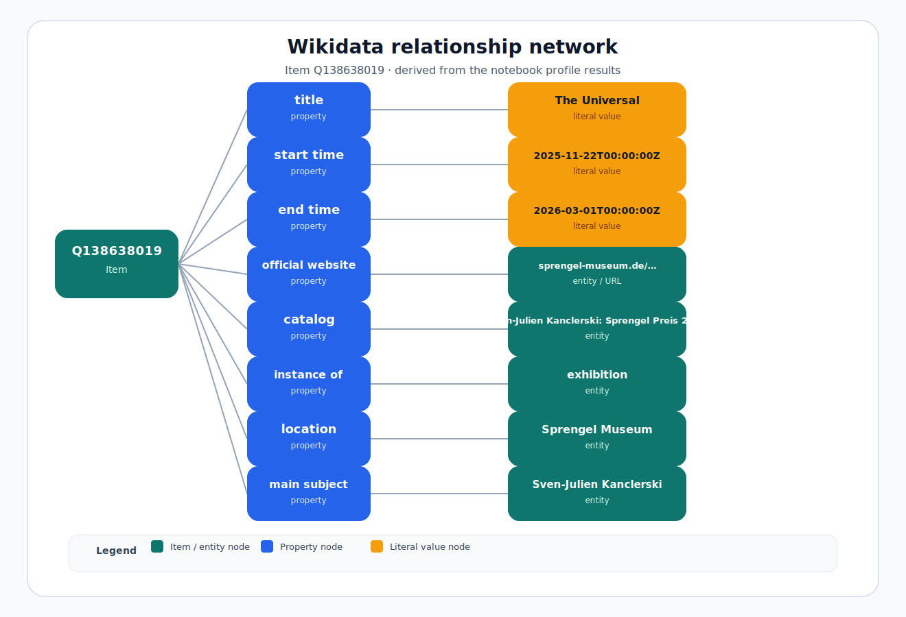

# Wikidata

This section documents Wikidata workflows, queries, and references for the project.

## Item profile page

- Open the rendered profile page: [Wikidata Item Profile](wikidata-item.html)

## Network diagram

The relationship graph below visualizes the item, its properties, and the linked entities from the existing SPARQL results used by the notebook profile.

## How data is retrieved

The profile page is generated from `wikidata-item.ipynb`, which:

1. Sets an `item_id` input (for example, `Q138547468`).
2. Builds a SPARQL query for all direct statements on the item.
3. Calls the Wikidata Query Service endpoint.
4. Renders the returned data as a styled HTML profile.

The helper module `wikidata_profile.py` contains reusable logic for querying, transforming, and rendering the data.
